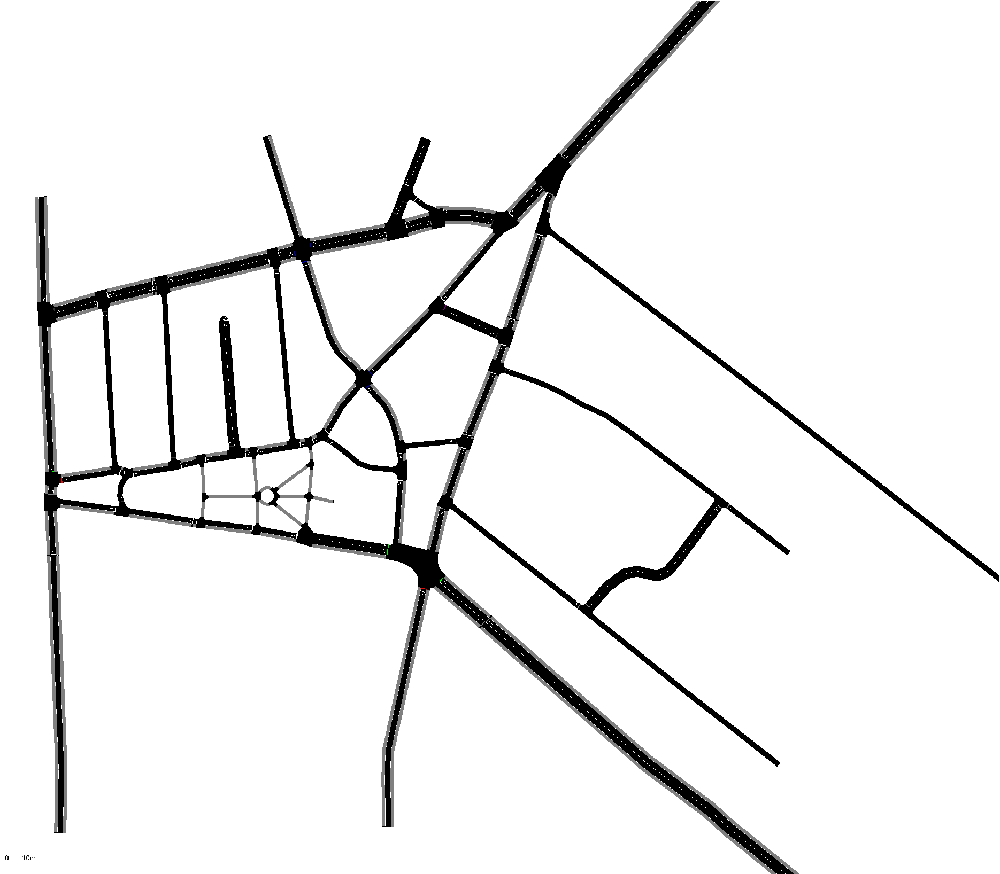

# Example Workflow in SUMO

This repository provides a simple example of building a SUMO scenario from scrach.

## Installation and setup
This workflow requires the latest development version of SUMO v1.5 (to incorporate a bug fix in the turn count router).

1. Install SUMO from [here](https://sumo.dlr.de/docs/Downloads.php#nightly_snapshots).
2. Download this repository

## Running the simulation
All files needed to run the simulation are included here.
1. Open `SUMO-GUI`
2. In the GUI, open the configuration file with `File > Open Simulation > \(thisfolder)\existing_configuration.sumocfg`
3. Run the simulation!

## Steps to generate the scenario files
Follow these steps to build the necessary files from scratch.
1. Download the OpenStreetMap datafile, `spring_street.osm`
2. Convert the OSM data with netconvert: `netconvert -c netconvert_configuration.netc.cfg`
3. Modify the existing configuration using `NETEDIT` and save the modified network as `spring_street_alternate.net.xml`
4. Generate the initial random traffic (use the modified network to ensure trips don't start or end on closed edges): `python <SUMO_HOME>/tools/randomTrips.py -n spring_street_alternate.net.xml -o random_trips.trip.xml --fringe-factor 1000 --edge-permission passenger --min-distance 50`  The option flags minimize the number of unrealistic trips in this scenario
5. Generate the initial route distribution for the existing network: `duarouter -n spring_street_baseline.net.xml --route-files random_trips.trip.xml -o random_routes.rou.xml --ignore-errors`
6. Calibrate the initial routes using existing turn counts: `python <SUMO_HOME>/tools/routeSampler.py -r random_routs.rou.xml -t existing-turns.xml -o calibrated_existing_routes.rou.xml --optimize full`
7. Obtain the trips by piping the output of the following to an xml file: `python <SUMO_HOME>/tools/route2trips.py calibrated_existing_routes.rou.xml`

These steps will generate the network and calibrated demand for the simulation.  Run the existing and baseline `sumocfg` files to get the results.
